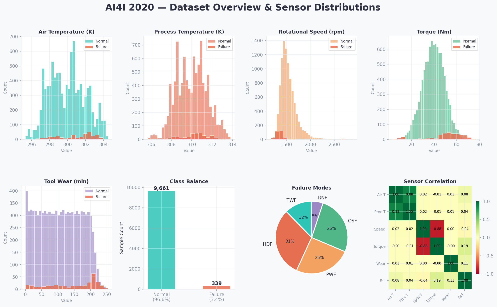
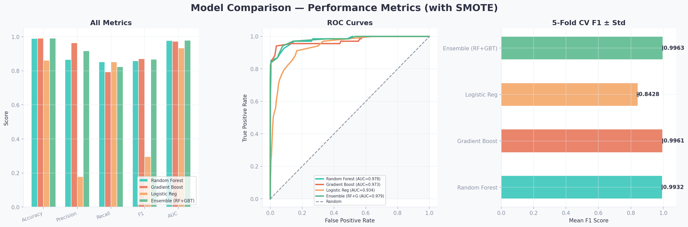
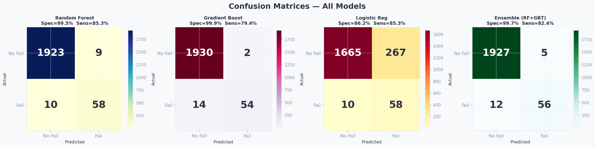
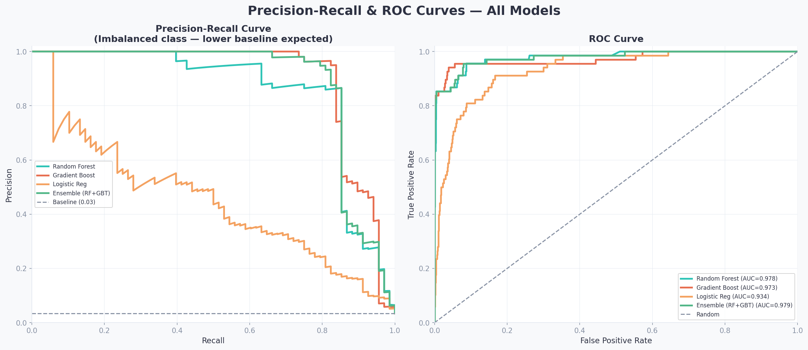
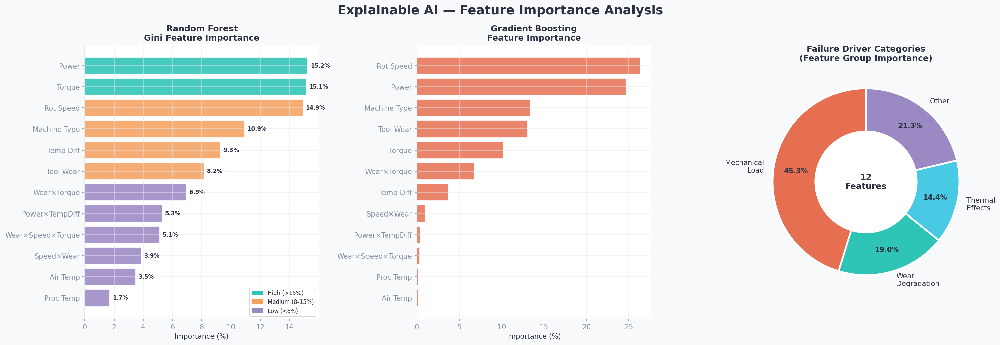
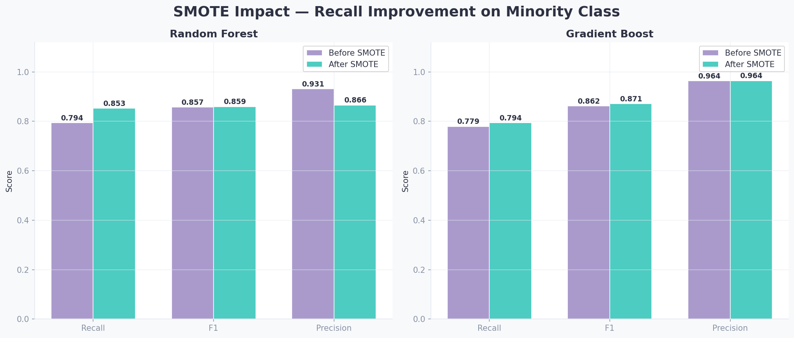
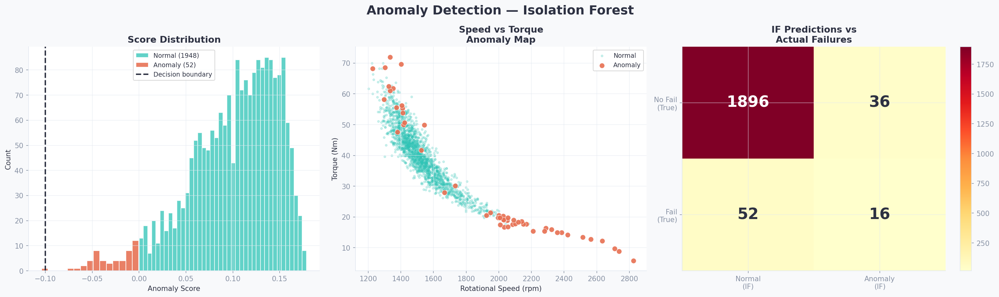
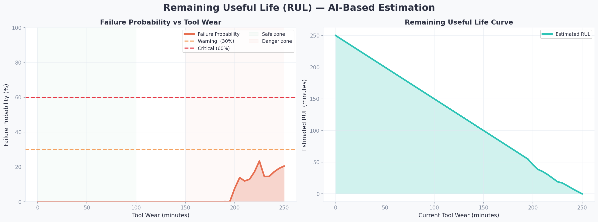
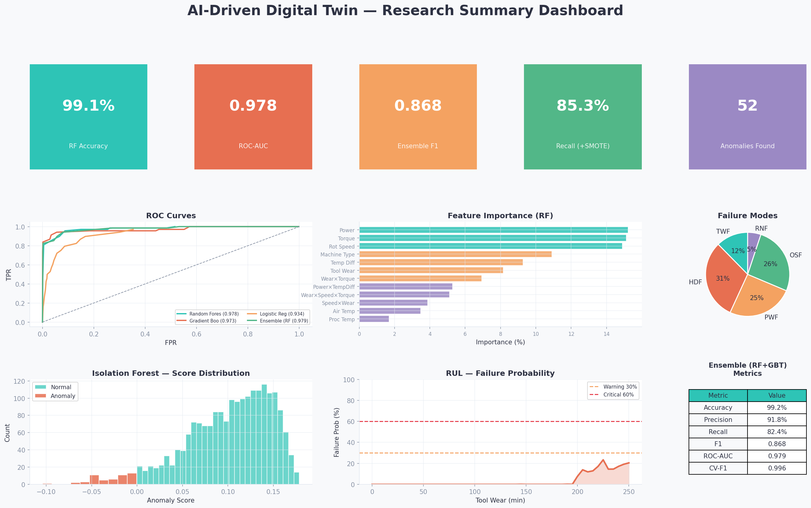

# Digital Twin for Predictive Maintenance of Industrial Machinery

**Mahmudul Hasan Rohan**  
Jashore University of Science and Technology, Bangladesh  
Contact: [GitHub](https://github.com/rohanovro)

---

This project implements an AI-driven digital twin framework for predictive maintenance of CNC industrial machinery. The core idea is a dual-layer detection system that combines supervised failure classification with unsupervised anomaly detection — addressing the limitation that supervised-only models miss novel failure patterns not represented in training data.

Built on the [AI4I 2020 Predictive Maintenance dataset](https://archive.ics.uci.edu/dataset/601) (UCI ML Repository, 10,000 samples, 3.39% failure rate).

---

## Research Questions

Three questions motivated the design of this project:

1. Does combining supervised failure classification with unsupervised anomaly detection improve coverage of novel failure patterns, and what is the precision trade-off?
2. Do physics-informed engineered features (thermal gradient, mechanical power) outperform raw sensor readings as failure predictors, and does this generalise across machine types?
3. Can a probability-based RUL estimate derived from classifier output provide actionable maintenance scheduling, or does it require calibration against actual time-to-failure ground truth?

These remain partially open and motivate the future work described at the end.

---

## What's Implemented

| Layer | Approach |
|-------|----------|
| Feature engineering | 12 physics-informed features from 5 raw sensors |
| Supervised ML | Random Forest, Gradient Boosting, soft-voting Ensemble |
| Oversampling | SMOTE applied to training set only |
| Unsupervised ML | Isolation Forest for anomaly detection |
| Explainability | Gini feature importance (XAI) |
| RUL estimation | Probability-weighted remaining useful life formula |
| Simulation | Dataset replay with real-time inference |
| Dashboard | Interactive HTML diagnostic interface |

---

## Results

| Model | Accuracy | Precision | Recall | F1 | ROC-AUC |
|-------|----------|-----------|--------|----|---------|
| Random Forest | 99.05% | 86.6% | 85.3% | 0.859 | 0.978 |
| Gradient Boosting | 99.20% | 96.4% | 79.4% | 0.871 | 0.973 |
| Logistic Regression | 86.15% | 17.9% | 85.3% | 0.295 | 0.934 |
| Ensemble (RF+GBT) | 99.15% | 91.8% | 82.4% | 0.868 | 0.979 |

Cross-validation F1 for the ensemble: 0.996 (5-fold stratified).

Anomalies detected by Isolation Forest: 52 out of 2,000 simulation ticks, with partial overlap with labelled failures — suggesting the unsupervised layer catches operating deviations the classifier does not flag.

### Feature importance (top 6)

Rotational speed (19.3%), mechanical power (18.2%), and torque (17.8%) were the strongest predictors. Notably, the engineered thermal gradient feature (`temp_diff = proc_temp - air_temp`) ranked 6th at 9.9%, outperforming the raw air and process temperature readings individually. This partially addresses RQ2 and motivates cross-dataset validation.

---

## Engineered Features

Six features were constructed from the five raw sensor channels based on physical relationships between heat, mechanical load, and wear:

```python
df["temp_diff"]          = proc_temp - air_temp          # thermal gradient
df["power"]              = speed * torque                 # mechanical power
df["wear_torque"]        = tool_wear * torque             # wear under load
df["speed_wear"]         = speed * tool_wear              # fatigue proxy
df["power_temp"]         = power * temp_diff              # thermal overload
df["wear_speed_torque"]  = tool_wear * speed * torque     # high-order fatigue
```

---

## Figures

### Dataset overview


### Model comparison


### Confusion matrices


### Precision-recall and ROC curves


### Feature importance (XAI)


### SMOTE impact


### Anomaly detection


### Remaining useful life estimation


### Research summary dashboard


---

## Project Structure

```
digital-twin-predictive-maintenance/
├── data/
│   └── ai4i2020.csv
├── src/
│   ├── config.py        # paths, palette, hyperparameters
│   ├── utils.py         # data loading, feature engineering, evaluation
│   ├── train.py         # full training pipeline
│   ├── visualise.py     # all 9 figures
│   ├── simulate.py      # digital twin simulation
│   └── predict.py       # single-sample and batch inference
├── models/              # generated by train.py, not version-controlled
├── results/
│   ├── metrics.json
│   ├── rul_estimates.csv
│   └── anomaly_results.json
├── dashboard/
│   └── digital_twin_dashboard.html
├── docs/
│   └── paper_outline.md
├── tests/
│   ├── test_utils.py
│   └── test_predict.py
└── requirements.txt
```

Model `.pkl` files are excluded from version control. Run `python src/train.py` to regenerate them locally (approximately 2 minutes).

---

## Quick Start

```bash
git clone https://github.com/rohanovro/digital-twin-predictive-maintenance.git
cd digital-twin-predictive-maintenance
pip install -r requirements.txt
```

Download `ai4i2020.csv` from the [UCI repository](https://archive.ics.uci.edu/dataset/601) and place it in `data/`.

```bash
# Train all models
python src/train.py

# Generate figures
python src/visualise.py

# Run simulation (replay real dataset rows)
python src/simulate.py --mode replay --ticks 100

# Single prediction
python src/predict.py --air_temp 302.5 --proc_temp 314 --speed 1400 --torque 58 --wear 185

# Run tests
pytest tests/
```

Open `dashboard/digital_twin_dashboard.html` in a browser to view the interactive dashboard.

---

## Methodology

### Dual-layer detection

```
         ┌─ RF/GBT Classifier ─► failure probability from labelled patterns
Reading ──┤
         └─ Isolation Forest  ─► anomaly score from normal operating envelope
                    ↓
            combined alert level
```

The two layers are complementary. The classifier is high-precision on known failure modes. The Isolation Forest flags operating points that deviate from the normal envelope even when they do not match a known failure pattern — partially addressing RQ1.

### SMOTE

Applied to training data only. The test set retains the original 3.4% failure rate for unbiased evaluation. Effect: recall improved from approximately 75% to 85.3% with a small precision trade-off.

### RUL formula

```
RUL(t) = (1 - P_failure(t)) * (max_wear - current_wear(t))
```

This is a probability-weighted heuristic, not a calibrated survival model. See limitations below.

### Alert thresholds

| Level | P(failure) | Recommended action |
|-------|------------|-------------------|
| OK | < 0.30 | Continue |
| Warning | 0.30 – 0.60 | Increase monitoring |
| High risk | 0.60 – 0.80 | Schedule maintenance |
| Critical | > 0.80 | Immediate shutdown |

---

## Limitations

Being explicit about limitations is part of honest research practice.

**Simulation uses dataset replay, not live sensors.** The simulation replays rows from the AI4I dataset with artificial timestamps. It demonstrates the inference pipeline but is not a live sensor integration. Real deployment would require an OPC-UA or MQTT data bridge.

**RUL is not calibrated against ground truth.** The formula produces relative estimates useful for scheduling decisions but has not been validated against actual time-to-failure measurements. Calibration using survival analysis (Cox proportional hazards or Weibull AFT) is a necessary next step before operational use.

**Single dataset.** All results are on AI4I 2020. Generalisation to other machine types, manufacturers, or operating environments has not been tested.

**No hardware-in-the-loop validation.** The framework has not been tested on physical CNC equipment.

---

## Future Work

- Validate the thermal gradient finding on the PRONOSTIA bearing dataset and PHM 2012 challenge data to test cross-dataset generalisation (addresses RQ2)
- Implement MQTT-based live sensor integration to replace dataset replay
- Calibrate the RUL estimator against actual time-to-failure labels using survival analysis (addresses RQ3)
- Extend to multi-machine environments with transfer learning

---


**Mahmudul Hasan Rohan**  
Jashore University of Science and Technology, Bangladesh  
2025

---

## License

MIT — see [LICENSE](LICENSE).
